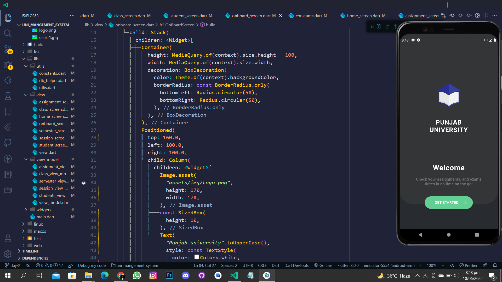
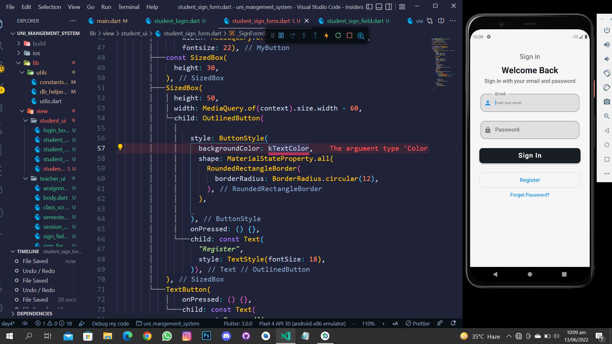
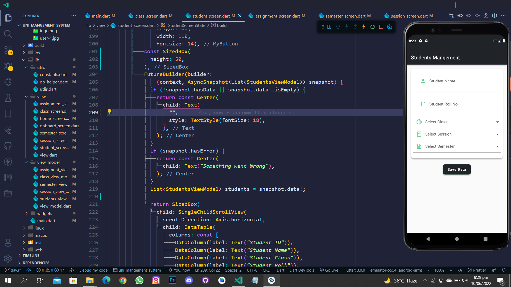
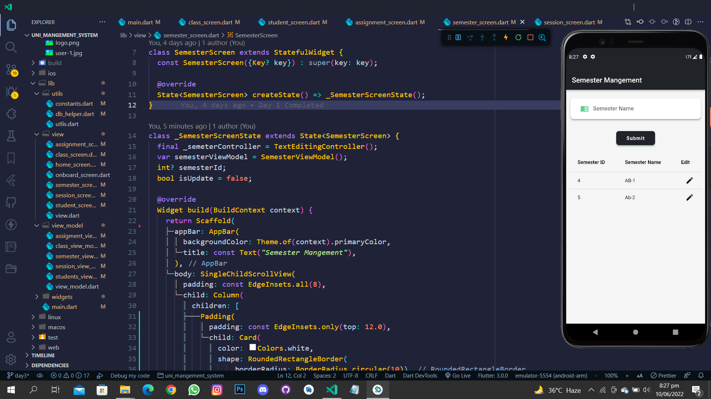
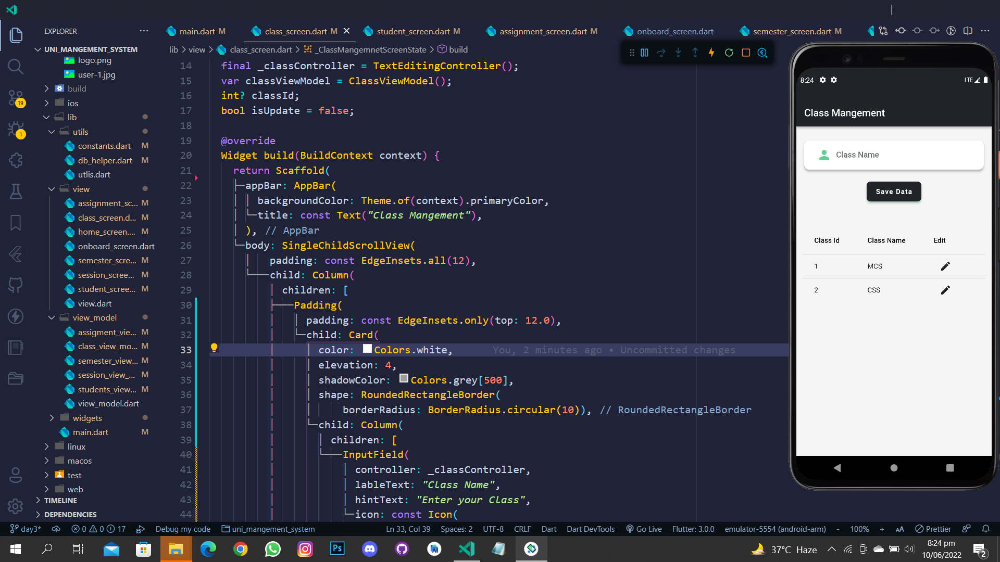
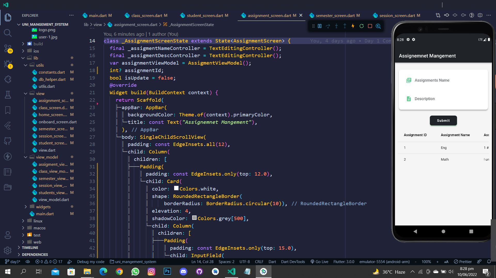
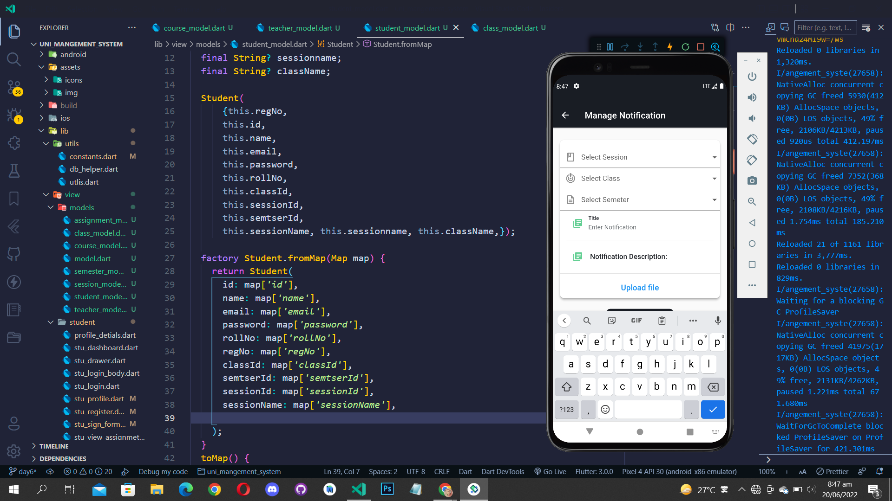
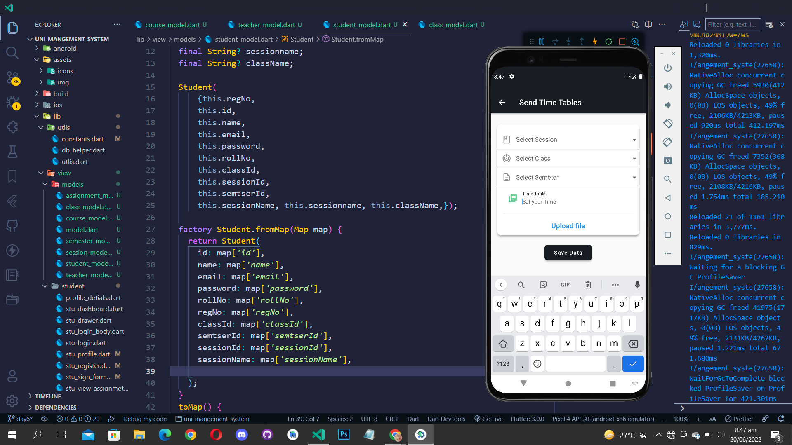
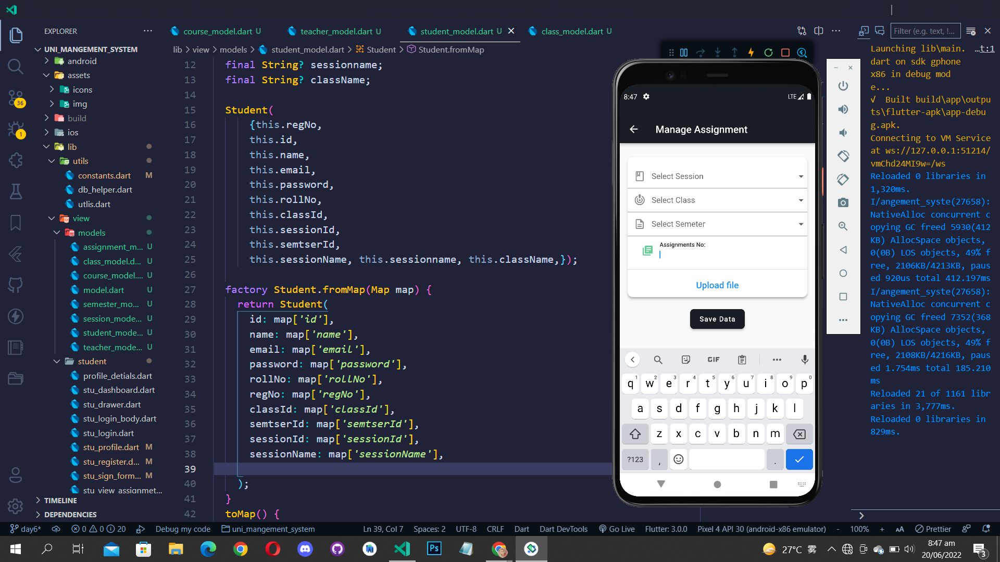

# 🎓 University Management System (Offline) – Flutter + Sqflite

This is a University Management System mobile application built using **Flutter** and **Sqflite** for offline data storage. It allows both **students** and **teachers** to interact with academic information in a structured and user-friendly way, even without internet access.

## 🚀 Features

### 👨‍🏫 Teacher Module
- Register and log in as a teacher
- Manage **classes**, **semesters**, **sessions**
- Create and update **assignments**
- View lists of students and subjects

### 👨‍🎓 Student Module
- Register and log in as a student
- View available subjects and their related assignments
- Track updated assignments for each subject

### 📱 Offline-First
- Data is stored locally using **Sqflite**
- Fully functional without an internet connection

## 📸 Screenshots

Here are some previews of the University Management System app:

### 🔐 Splash Screen


### 🔐 Login Screen


### 🔐 Student Screen


### 🧑‍🏫 Semester Screen 


### 📚 Class Management


### 📝 Assignment List


### 📝 Session Screen 


### 📝 Manage Notification Screen 


### 📝 Send Time Table Screen 


### 👨‍🎓 Student View – Assignments by Subject


## 🛠️ Built With
- **Flutter** – UI toolkit
- **Sqflite** – Local SQLite database plugin
- **Provider** (or your state management solution) – For managing app state

1. **Clone the repo:**
   ```bash
   git clone https://github.com/SuhaibRumi/Uni_management_System_Sqflite
   cd Uni_management_System_Sqflite

2. Install dependencies:
flutter pub get

3. Run the app:
flutter run


